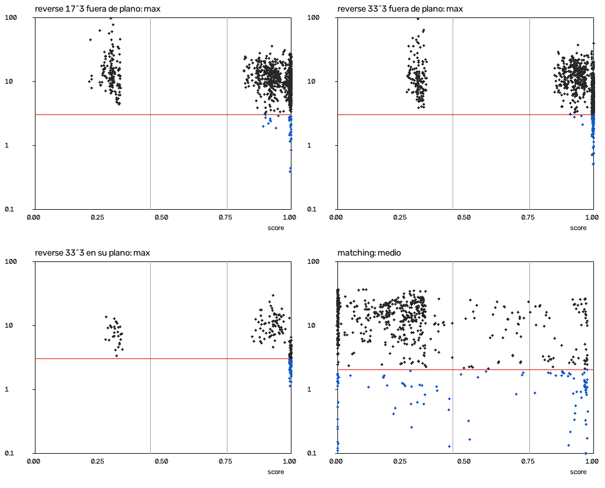

# CALIBRACIÓN DE LA CONFIANZA — alta / media / baja, contra el error real

**Agente de calibración, día 4 (16-09-2026).** No escribí nada del cálculo de la confianza y
no lo he cambiado. Fuera de `tests/calibracion/` y de este archivo sólo he tocado **el
comentario** de `CONFIDENCE_ALTA` y `CONFIDENCE_MEDIA` en `core/umbrales.py`; los valores
siguen siendo 0.75 y 0.45. Nada en `gui/`, nada en git, nada en `/Volumes`, sin red, sin Resolve.

---

## Veredicto

**No. La confianza no predice el error que decide, y por eso no he movido los umbrales:
no hay dónde ponerlos.**

- **`reverse` (ingeniería inversa): no predice.** Con material sin comprimir y rejilla 33³ la
  nota vale **1.0 en las 100 extracciones**, mientras el ΔE2000 máximo fuera de plano va de
  **0.50 a 39.26**. Lo único que ordena es «¿el material viene comprimido?». Dentro de un mismo
  tipo de material la correlación con el máximo es nula o va al revés.
- **`matching` (igualado de clips): predice poco, y sólo una cosa: «estas dos escenas son
  distintas».** Con la misma escena, que es cuando igualar tiene sentido, la nota **no
  predice** (AUC 0.40, IC95 0.23–0.59).
- **Ningún corte de la nota deja el 95% de los casos bajo el límite.** Lo mejor posible:
  17.0% en `reverse` 33³ fuera de plano, 6.4% en 17³ y 51.1% en `matching`.

El «ALTA 100%» con máximo 5.53 de `capturas/15-reverse-sin-vineta.png` **no es un caso raro:
es lo normal.** Con la rejilla del panel (17³), el **93%** de los «100%» en su propio plano
pasa de 3.0 de máximo (§6).

---

## 1 · Cómo calcula cada motor su nota (lo he leído, no lo he tocado)

Los dos usan `core.matching.confianza.puntuar_confianza`: cada métrica pasa por una rampa
lineal a una «subnota» de 0 a 1, y

    nota = sqrt( min(subnotas) × media_geométrica(subnotas) ) × (0.35 si hay desajuste de contenido)

Luego `confidence_level()` la convierte en palabra con 0.75 / 0.45. **Lo que cambia es qué
subnotas se le pasan:**

| Subnota | `reverse` (`core/reverse/invertir.py`) | `matching` (`core/matching/empareja.py`) |
|---|---|---|
| `n_muestras` | todos los píxeles del par (≥ 20.000 → 1) | menor de las dos listas |
| `solape` | histogramas de **su propio plano** tras CDL+LUT contra el coloreado | origen transportado contra la referencia |
| `condicion` | covarianza del original | covarianza del origen |
| `residuo_de` | **ΔE2000 MEDIO en su propio plano** (rampa 1.0 → 8.0) | ΔE medio entre el CDL y **su propio objetivo MKL**, no contra la verdad |
| `extrapolacion` | — | parte de la referencia fuera de la caja del origen |
| `ganancia` | — | estirado de la matriz de transporte |
| `desajuste` | detector de contenido entre original y coloreado | detector de contenido entre clip y referencia |

**Consecuencia de diseño, antes de medir nada:** la nota de `reverse` se calcula **sólo con el
par de extracción**. No mira el máximo, ni la cobertura del cubo (la cobertura sale como
**frase** en `reasons`, pero `_con_razones_de_cobertura` dice expresamente «la NOTA no se
toca»), ni el plano al que se va a aplicar el grado. **Da el mismo número para cualquier plano
de destino.** Por construcción no puede saber si el LUT se puede llevar a otro plano.

**¿Se parecen las dos distribuciones? No** (`grep "CAL distribucion"`):

| | Percentiles 5 / 25 / 50 / 75 / 95 | Histograma en 20 tramos de 0 a 1 | «alta / media / baja» |
|---|---|---|---|
| `reverse` 17³ (200 extracciones) | 0.299 / 0.897 / 0.976 / 1.000 / 1.000 | `0 0 0 0 1 12 16 0 0 0 0 0 0 0 0 0 5 19 38 109` | 171 / **0** / 29 |
| `reverse` 33³ (200 extracciones) | 0.313 / 0.915 / 0.996 / 1.000 / 1.000 | `0 0 0 0 0 6 23 0 0 0 0 0 0 0 0 0 0 17 34 120` | 171 / **0** / 29 |
| `matching` (720 pares) | 0.000 / 0.000 / 0.249 / 0.340 / 0.970 | `202 22 33 51 53 88 98 11 8 3 9 3 10 7 15 5 15 6 24 57` | 107 / 47 / 566 |

`reverse` es **bimodal**: o ~1, o ~1 multiplicado por 0.35. **Ninguna** de las 400
extracciones cae entre 0.45 y 0.75, así que «media» no sale nunca en ingeniería inversa.
`matching` está repartida y tiene 202 de 720 pares en el primer tramo (la subnota de
`extrapolacion` llega a 0 en cuanto las cámaras difieren algo de exposición). Un mismo par de
umbrales no puede significar lo mismo en las dos. Pero la pregunta se queda en nada, porque
ninguna de las dos predice lo suficiente (§3–§5).

Qué subnota se mueve (`grep "CAL componentes"`): en `reverse` sólo `residuo_de` (50–60% de
las extracciones, casi todas comprimidas), `solape` (8–12%) y `desajuste` (14.5%);
`n_muestras` y `condicion` **no bajan de 1 en ninguna**, ni con la escena más pobre.

---

## 2 · El montaje

Todo sale de `tests/calibracion/`: `material.py` (**no importa `core`**; hay un test que lo
comprueba), `medir.py` (pide la confianza a los motores y mide) y `analizar.py` (cruza).

**Escenas propias**, en luz lineal Rec.709 llevadas al espacio de trabajo (DWG / DaVinci
Intermediate) con `colour-science`: fondo en degradado, N objetos con modelado de luz, brillos
especulares y grano. **Cinco riquezas de color** (`muy_pobre` de 2 objetos y un tono casi gris
a `muy_rica` de 24 objetos y todo el círculo de tono). Cobertura del cubo 33³ por extracción:
de 0.04% a 1.84%, mediana 0.31%, del orden del 0.46% de un plano normal
(`grep "CAL material reverse"`).

**Grado conocido** (`material.aplicar_grado`): CDL ASC + curva en S sobre la luma + virado de
sombras y altas luces + una secundaria que gira y satura una banda de tono. **Es una función,
no un LUT de rejilla**, y lo aplica mi código, no `CDL.apply` ni `LUT3D.apply`. Fuerza: ΔE2000
medio entre original y coloreado de 0.95 a 8.52 (suave) y de 2.57 a 19.36 (fuerte).

**Condiciones barridas, todas cruzadas:**

| Factor | Valores |
|---|---|
| Riqueza de color (cobertura) | 5 niveles |
| Compresión | ninguna / **h264** por `tests/media/generate.make_clip(..., codec="h264")` (yuv420p, 8 bits), ida y vuelta por ffmpeg |
| Recorte de altas luces | no / sí: techo por canal en el percentil 92 del canal más alto |
| Fuerza del grado | suave / fuerte (`reverse`); ninguno / suave / fuerte (`matching`) |
| Semillas | 10 por celda (`reverse`), 6 (`matching`) |
| Rejilla (`reverse`) | **17³** (la que usa el panel, `gui/reverse_puente.TAM_REJILLA_PANEL`) y **33³** (la del `.cube`) |
| Plano de aplicación (`reverse`) | **el suyo** y 5 más: otra toma de la misma paleta, tono +15°, tono +60° y +0.7 pasos, tono +150° con más saturación, otra paleta |
| Disparidad de contenido (`matching`) | la misma escena y las 5 variantes de arriba |

Total: **200 extracciones × 2 rejillas × 6 planos = 2.400 filas** de `reverse` (2.000 fuera de
plano) y **720 pares** de `matching`. La disparidad también va como número (intersección de
histogramas 17³ de las escenas sin grado): de 0.007 a 0.970 en los planos de `reverse`.

**La verdad y lo que se compara:**

- `reverse`: en cualquier plano P, verdad = `grado(P)`; predicción = `lut.apply(cdl.apply(P))`
  con lo que devolvió `invertir_grado`. Con compresión, original y coloreado se comprimen
  **cada uno por su lado** para extraer, y la verdad de P se calcula sobre P ya comprimido: se
  mide el grado extraído, no el ruido del códec en destino.
- `matching`: clip O = cámara_O(escena 1), referencia R = look_R(cámara_R(escena 2)). Las
  cámaras son matrices 3×3 en lineal (ganancias, diafonía, ±0.7 pasos). Verdad = lo que habría
  grabado la cámara R con el look R **de la escena del clip**:
  `look_R(cámara_R(cámara_O⁻¹(O)))`, sobre O ya decodificado. Salida del motor =
  `cdl.apply(O)`, que es lo que aplica la GUI (`emparejar` sin `con_lut`, igual que
  `gui/datos_demo.py`), con 14.400 píxeles de entrada, los mismos que le pasa la GUI a 640×360.
- **Error real**: ΔE2000 de `colour-science` (DI → DWG lineal → XYZ sin CAT → Lab D65 →
  `delta_E_CIE2000`), **máximo, p95 y medio** sobre todos los píxeles, y los mismos quitando la
  verdad con L\* > 100 (`_sdr`). Comprobación cruzada: sin compresión, en su plano, mi máximo y
  el de `core.color` difieren como mucho **5.16e-05** en 200 filas (`grep "CAL guardia"`).

**Resolución 320×180** para no saturar la máquina (4 procesos). Comprobado en 20 extracciones
(240 filas) y 40 pares a 640×360 (§7): la conclusión no cambia.

**Reproducible bit a bit.** Volví a lanzar la medida entera y comparé con la anterior:
**0 diferencias** en score, nivel, razones y los tres ΔE en las 3.600 filas, compresión h264
incluida.

**Guardia.** Cada fila lleva la huella sha256 del código (AST, sin comentarios) de
`core/umbrales.py`, `core/contracts.py`, `core/matching/{confianza,empareja,contenido}.py` y
`core/reverse/invertir.py`: `b44ecbd5f521`, la misma en todos los CSV y en el código actual.
`core` resuelve al repo vivo (`sidebflms-color/core/__init__.py`), rama `dia4`.

**Intervalos:** bootstrap **por escena** (50 escenas en `reverse`, 30 en `matching`), 1.000
remuestreos, semilla fija. Por escena y no por fila porque las cinco filas fuera de plano de
una extracción comparten nota, y las cuatro condiciones de compresión y recorte comparten
escena y grado.

### Comandos

```bash
# medir (primer plano, ~6 min en total con 4 procesos; lo escribe todo en tests/calibracion/datos/)
.venv/bin/python -m tests.calibracion.medir reverse  --desde 0   --hasta 100
.venv/bin/python -m tests.calibracion.medir reverse  --desde 100 --hasta 200
.venv/bin/python -m tests.calibracion.medir matching --desde 0   --hasta 360
.venv/bin/python -m tests.calibracion.medir matching --desde 360 --hasta 720
.venv/bin/python -m tests.calibracion.medir reverse  --resol 640 --casos 0,11,22,33,40,51,62,73,80,91,102,113,120,131,142,153,160,171,182,193
.venv/bin/python -m tests.calibracion.medir matching --resol 640 --casos 0,19,38,57,72,91,110,129,144,163,182,201,216,235,254,273,288,307,326,345,360,379,398,417,432,451,470,489,504,523,542,561,576,595,614,633,648,667,686,705

# analizar (5 s; lee los CSV, escribe score_vs_error.png)
.venv/bin/python -m tests.calibracion.analizar | grep "<etiqueta>"
```

La salida completa de la última ejecución está en `tests/calibracion/salida_analisis.txt`.
**Todas las cifras de este documento salen del comando `analizar` con el `grep` indicado.**

---

## 3 · ¿Correlaciona?

Spearman de la nota contra el error. **Negativo = el signo bueno** (más nota, menos error).

### 3.1 Todo junto (`grep "CAL spearman reverse\|CAL spearman matching"` y `grep "CAL rho_ic"`)

| Motor | Filas | ρ con el máximo | ρ con el p95 | ρ con el medio |
|---|---|---|---|---|
| `reverse` 17³ **fuera de plano** | 1.000 | −0.290 (IC −0.340, −0.239) | −0.324 | −0.403 |
| `reverse` 33³ **fuera de plano** | 1.000 | −0.551 (IC −0.603, −0.501) | −0.559 | −0.582 |
| `reverse` 17³ en su plano | 200 | −0.570 | −0.816 | −0.900 |
| `reverse` 33³ en su plano | 200 | −0.733 | −0.827 | −0.852 |
| `matching` | 720 | −0.096 | −0.239 | −0.269 (IC −0.394, −0.134) |

Visto así, en `reverse` parece que correlaciona. **No es verdad, y ésta es la parte importante.**

### 3.2 Dentro de una misma clase de material

Separando por compresión y recorte (`grep "CAL spearman reverse" | grep "compresion=. recorte"`):

| `reverse`, fuera de plano | Notas distintas | ρ máximo 17³ | Notas distintas | ρ máximo 33³ |
|---|---|---|---|---|
| sin compresión, sin recorte | 11 | −0.105 | **1** | **no definido: la nota es 1.0 siempre** |
| sin compresión, con recorte | 10 | −0.046 | **1** | **no definido: 1.0 siempre** |
| con compresión, sin recorte | 50 | −0.081 | 50 | **+0.114** (al revés) |
| con compresión, con recorte | 50 | −0.234 | 50 | **+0.035** (al revés) |

En su propio plano pasa lo mismo: en 33³ con compresión, **+0.430 y +0.337**, al revés.

**Lo que ocurre es una paradoja de Simpson.** La compresión hace dos cosas a la vez: **baja la
nota** (sube el ΔE medio en su plano y dispara el detector de desajuste en el 26–32% de los
pares comprimidos) y **sube el error**. Así que la nota separa «material limpio» de «material
comprimido», y como el comprimido falla más, sale una correlación global. **Dentro de cada
clase de material, la nota no ordena el máximo.**

La prueba más limpia (`grep "CAL constante"`):

| `reverse` 33³, sin compresión | Filas | Nota | Máximo: mín · mediana · máx | Cumplen máx < 3 |
|---|---|---|---|---|
| fuera de plano, sin recorte | 250 | **1.0 en las 250** | 0.50 · 4.87 · **39.26** | 16.0% |
| fuera de plano, con recorte | 250 | **1.0 en las 250** | 0.52 · 5.47 · 22.62 | 18.0% |
| en su plano, sin recorte | 50 | **1.0 en las 50** | 1.12 · 2.55 · 5.70 | 72.0% |
| en su plano, con recorte | 50 | **1.0 en las 50** | 1.34 · 3.11 · 6.45 | 44.0% |

AUC de la nota para «cumple» en esas cuatro celdas: **0.500 exacto**. Una constante no predice
nada. En 17³ sin compresión la nota se mueve un poco (de 0.978 a 1.0) y el AUC es 0.60–0.61.

**Aquí es donde el encargo dice «para ahí y dilo».** La correlación con el máximo fuera de
plano **es nula o del signo equivocado** en cuanto se compara material con material. He
seguido lo justo para enseñar que tampoco hay umbral posible (§5), porque es la pregunta que
Mario hará a continuación.

### 3.3 `matching`

| | Filas | ρ con el medio | AUC para medio < 2.0 |
|---|---|---|---|
| todo | 720 | −0.269 | **0.702** (IC 0.584, 0.825) |
| por compresión × recorte | 180 cada una | −0.221 a −0.298 | 0.683 a 0.730 |
| **la misma escena** (`disparidad_tipo=identica`) | 120 | **+0.151** (al revés) | **0.399** (IC 0.233, 0.587) |
| sin desajuste | 267 | −0.244 | 0.642 (IC 0.546, 0.742) |
| con la nota ≥ 0.75 | 107 | −0.145 | — |

Por disparidad (`grep "CAL spearman matching | disparidad"`), dentro de cada tipo la ρ con el
medio va de −0.225 a +0.151. **La nota de `matching` sabe algo, pero es esto:** con la misma
escena, su mediana es 0.831; con escenas distintas, de 0.109 a 0.300
(`grep "CAL desajuste matching] disparidad"`). Dice «éstas no son la misma escena», que es
real y útil. Lo que no dice es si el igualado de dos planos de la misma escena ha salido bien.

---

## 4 · Nota contra error, por tramos

`grep "CAL tramos"`. «Cumple» = máximo < 3.0 en `reverse`; medio < 2.0 en `matching`.

**`reverse` 33³, fuera de plano** (el caso de uso: ¿me llevo este LUT a otro plano?)

| Nota | Filas | Escenas | Máx. mediana | p95 mediana | Medio mediana | **Cumple** |
|---|---|---|---|---|---|---|
| [0.20, 0.45) baja | 145 | 17 | 10.24 | 5.63 | 3.17 | 0.0% |
| [0.45, 0.75) media | **0** | — | — | — | — | — |
| [0.75, 0.90) | 85 | 12 | 11.65 | 4.88 | 2.32 | 0.0% |
| [0.90, 0.99) | 265 | 29 | 12.97 | 4.49 | 2.13 | 1.1% |
| [0.99, 1.00] | 505 | 50 | 5.17 | 2.14 | 0.93 | **16.8%** |

**`reverse` 17³, fuera de plano** (la rejilla del panel)

| Nota | Filas | Máx. mediana | Medio mediana | **Cumple** |
|---|---|---|---|---|
| [0.20, 0.45) | 145 | 12.11 | 4.35 | 0.0% |
| [0.45, 0.75) | **0** | — | — | — |
| [0.75, 0.90) | 120 | 12.68 | 2.74 | 1.7% |
| [0.90, 0.99) | 270 | 10.72 | 2.23 | 3.0% |
| [0.99, 1.00] | 465 | 9.05 | 1.66 | **5.6%** |

**`matching`**

| Nota | Filas | Escenas | Máx. mediana | Medio mediana | **Cumple (medio < 2)** | Máx. < 3 |
|---|---|---|---|---|---|---|
| [0.00, 0.20) | 308 | 29 | 29.21 | 13.69 | 8.4% | 2.9% |
| [0.20, 0.45) | 258 | 30 | 38.03 | 13.97 | 7.4% | 3.5% |
| [0.45, 0.75) | 47 | 21 | 18.80 | 7.52 | 17.0% | 8.5% |
| [0.75, 0.90) | 26 | 14 | 15.10 | 3.02 | 30.8% | 0.0% |
| [0.90, 0.99) | 81 | 25 | 14.40 | 2.42 | **48.1%** | 12.3% |

Gráfica: `tests/calibracion/score_vs_error.png` (nota en horizontal, error en escala
logarítmica, línea roja = límite, líneas grises = 0.45 y 0.75, azul = cumple).



---

## 5 · Criterio y umbrales

### El criterio que he usado, y por qué

**ALTA** = el menor corte t tal que, entre los casos con nota ≥ t, **el 95% cumple el
criterio**. Y se lo exijo **al extremo inferior del intervalo bootstrap**, no a la estimación
puntual, porque con pocos casos por encima de t un 95% puede ser suerte. Criterio: máximo < 3.0
(`LIMITE_T1_DELTA_E_MAXIMO`) en `reverse`, fuera de plano; medio < 2.0
(`LIMITE_T3_DELTA_E_PEOR_PAR`) en `matching`, que es la cifra con la que T3 juzga cada par.

Es el criterio que tiene sentido para lo que Mario lee: «alta» tiene que querer decir «me lo
llevo sin mirar». Si «alta» cumple el 17% de las veces, no puede llamarse así.

### Resultado (`grep "CAL umbral"`)

| | Corte t | Casos con nota ≥ t | Cumplen | IC95 |
|---|---|---|---|---|
| `reverse` 33³ fuera | 0.75 (hoy) | 855 | 10.3% | 8.4 – 12.5% |
| | 0.90 | 770 | 11.4% | 9.3 – 14.1% |
| | 1.00 | 500 | **17.0%** ← lo mejor posible | 13.8 – 20.6% |
| `reverse` 17³ fuera | 0.75 (hoy) | 855 | 4.2% | 2.4 – 6.0% |
| | 1.00 | 405 | **6.4%** ← lo mejor posible | 4.0 – 9.0% |
| `reverse` 33³ en su plano | 1.00 | 100 | 58.0% ← lo mejor posible | 46.0 – 69.0% |
| `matching` | 0.45 | 154 | 35.7% | 25.3 – 47.5% |
| | 0.75 (hoy) | 107 | 43.9% | 29.8 – 56.4% |
| | 0.90 | 81 | 48.1% | 32.9 – 63.0% |
| | ≥ 0.9678 | 47 | **51.1%** ← lo mejor con ≥ 20 casos | — |

**No hay ningún corte que llegue al 95%, ni con la estimación puntual, en ningún motor, en
ninguna rejilla, ni siquiera en su propio plano.** Tampoco con el máximo sin brillos (`_sdr`):
el AUC apenas cambia (0.762 frente a 0.760 en 33³ fuera).

**MEDIA** tampoco se puede fijar con estos datos. En `reverse` el tramo 0.45–0.75 está
**vacío** (0 de 400 extracciones): mover 0.45 no cambia ningún veredicto. En `matching`, por
debajo de 0.45 cumple el 7–8% y entre 0.45 y 0.75 el 17%, con 47 pares y escenas compartidas:
no hay un salto que separe «merece una revisión» de «no sirve».

### Por eso no se cambian

**`CONFIDENCE_ALTA` = 0.75 y `CONFIDENCE_MEDIA` = 0.45 se quedan como estaban.** En
`core/umbrales.py` he sustituido «NO SE SABE POR QUÉ VALE ESTO» por lo medido: que se intentó
calibrar, que la nota no predice el error y que por eso no hay nada que calibrar.
`tests/test_umbrales.py` no se toca, porque los valores no cambian.

Moverlos sería lo peor que se puede hacer: subir ALTA a 0.99 no convierte «alta» en «fiable»
(17% en 33³), sólo haría que el mismo número sin significado pareciera calibrado.

---

## 6 · El caso de la captura: «ALTA 100%» con máximo 5.53

He reproducido el par de la captura (`gui.datos_demo.par_ingenieria_inversa(con_vineta=False)`,
640×360, `invertir_grado` del repo): **17³ → nota 1.0, máximo 5.5259, medio 0.7024**. Las
cinco subnotas valen 1.0. El medio 0.70 cae por debajo del 1.0 donde empieza a bajar la rampa
de `residuo_de`, así que la nota no se entera del 5.53. La razón que ve Mario es «no hay nada
que objetar». Con 33³ sale 1.0 y 3.9163. *(Comprobación puntual hecha a mano, sin test que la
fije: no va a `CIFRAS.md`.)*

**¿Es raro? No, es lo normal** (`grep "CAL captura"`):

| Rejilla | Dónde | «alta» | …y máx ≥ 3.0 | «100%» (nota ≥ 0.995) | …y máx ≥ 3.0 |
|---|---|---|---|---|---|
| **17³ (panel)** | **en su plano** | 171 de 200 | **165 (96.5%)** | 86 | **80 (93.0%)** |
| 17³ | fuera de plano | 855 de 1.000 | 819 (95.8%) | 430 | 404 (94.0%) |
| 33³ | en su plano | 171 de 200 | 113 (66.1%) | 100 | 42 (42.0%) |
| 33³ | fuera de plano | 855 de 1.000 | 767 (89.7%) | 500 | 415 (83.0%) |

En su plano, contando con el máximo que enseña la pantalla (el del repo contra el coloreado),
los recuentos son los mismos: 80 de 86 en 17³ y 42 de 100 en 33³.

Un ejemplo que lo enseña entero, y que queda como test (§9): **caso 44** (paleta pobre, grado
fuerte, sin compresión, 33³). Nota 1.0, «alta», «no hay nada que objetar» **en los seis
planos**. Máximo: **2.4121** en su plano, **3.6594** en otra toma de la misma paleta,
**3.6208** con el tono +15°, **5.4993**, **6.8741** y **7.0464** en los demás.

---

## 7 · ¿Cambia algo la resolución?

`grep "CAL resolucion"`. Mismos casos a 320×180 y a 640×360:

| | Filas | \|Δ nota\| mediana · máx | Mismo nivel | ρ del error 320 frente a 640 | AUC 320 · 640 |
|---|---|---|---|---|---|
| `reverse` | 240 | 0.001 · 0.065 | **100%** | +0.871 (máximo) | 0.793 · 0.784 |
| `matching` | 40 | 0.000 · 0.248 | 95% | +0.998 (medio) | 0.930 · 0.910 |

Y lo que decide el veredicto: **en 33³ sin compresión la nota es 1.0 en el 100% de los casos
también a 640×360**. En 17³ sin compresión, 1.0 en el 80% a las dos resoluciones. La
conclusión no depende de la resolución. *(El AUC de `matching` en esta submuestra de 40 es más
alto que en los 720; es la submuestra, no la resolución: 320 y 640 coinciden entre sí.)*

---

## 8 · Lo que he visto sin que me lo pidieran

1. **El detector de desajuste salta con el mismo plano cuando viene comprimido.** En `reverse`,
   original y coloreado son **el mismo encuadre**, y aun así «estos dos planos no parecen la
   misma escena» salta en el **32%** (sin recorte) y el **26%** (con recorte) de los pares h264.
   Sin compresión, en el 0% (`grep "CAL desajuste reverse"`). Multiplica la nota por 0.35, y
   es **casi toda la variación que tiene la nota de `reverse`**.
2. **En `matching` el detector falla en los dos sentidos.** Salta en el 16.7% de los pares
   **con la misma escena** y **no** salta en el 22–43% de los de escenas distintas.
3. **Con escenas distintas, igualar deja el clip peor que no tocarlo, y a veces lo llama
   «alta».** ΔE medio sin tocar: mediana 11.55. Después de igualar: de 8.02 (otra toma) a 22.33
   (otra paleta). **42 pares con escenas distintas salen «alta» y no cumple ninguno**. Con la
   misma escena: 65 «alta», 47 cumplen (`grep "CAL material matching"`).
4. **`make_clip(..., codec="h264")` codifica con la matriz BT.601 y etiqueta BT.709.** Una
   rampa decodificada con BT.709, como dice la etiqueta, vuelve con un error medio de 0.027;
   con BT.601, de 0.0046 (test `test_la_ida_y_vuelta_por_h264_no_cambia_la_matriz`, que
   comprueba el segundo; el primero lo medí a mano). Mi material decodifica con BT.601. **No es
   mi archivo y no lo he tocado**, pero cualquiera que lea esos .mp4 con un decodificador que
   respete la etiqueta verá un cambio de color que no es compresión.
5. **La frase «no hay nada que objetar» sale con máximos de 5 a 39.** Es texto que Mario lee
   tal cual, y lo decide la misma nota.

---

## 9 · Tests (`tests/calibracion/test_calibracion.py`)

`.venv/bin/python -m pytest tests/calibracion -q -rx` → **6 passed, 1 xfailed** en 2.6 s.
`ruff check tests/calibracion` → `All checks passed!`

| Test | Qué afirma | Estado |
|---|---|---|
| `test_el_material_no_importa_core` | `material.py` no importa `core` | pasa |
| `test_la_ida_y_vuelta_por_h264_no_cambia_la_matriz` | rampa por h264 con error medio < 0.01 | pasa |
| `test_el_grado_conocido_es_un_grado_y_no_la_identidad` | ΔE medio del grado en rango | pasa |
| `test_reverse_33_sin_compresion_da_siempre_score_uno_con_cualquier_error` | desde los CSV: 600 filas con nota 1.0, máximo fuera de plano de < 1 a > 20 | pasa |
| `test_ningun_umbral_de_score_deja_el_95_por_ciento_bajo_el_limite` | desde los CSV, en los cuatro grupos | pasa |
| `test_centinela_una_extraccion_score_uno_y_maximos_de_2_4_a_7_0` | **en vivo**, caso 44: nota 1.0 en los 6 planos, máx. 2.4121 / 3.6594 / 7.0464 | pasa |
| `test_alta_en_reverse_garantiza_maximo_bajo_3_en_otro_plano` | «alta» ⇒ máximo < 3 fuera de plano | **`xfail(strict=True)`**, con cifras, límite, comando y qué haría falta |

**Tests de otros:** no he cambiado ningún valor, así que ningún test que asuma 0.75 / 0.45 se
puede haber puesto rojo por mí. Pasé `test_umbrales.py`, `test_umbrales_literales.py`,
`test_contratos.py`, `test_matching_confianza.py` y `test_sin_vacio.py`: **170 passed, 1
failed**. El rojo es `test_sin_vacio.py::test_ningun_test_comprueba_una_coleccion_que_puede_venir_vacia_sin_guarda`,
y lo que señala está en **`tests/fuera_de_plano/test_t5_lote.py`** (líneas 271 y 279), del
otro agente. No es mío y no lo he tocado; mis archivos no aparecen en ese barrido.

---

## 10 · Límites de esta medida

- **Material sintético.** Bordes duros, paletas controladas, un fotograma por plano. En
  material real, **no medido**.
- **Mi grado es más difícil de recuperar que el de T5.** Incluye una secundaria y es una
  función, no un LUT horneado en 33³. En su plano, sin compresión ni recorte y en 33³, cumple
  el 72% (T5 daba 10 de 12). Eso cambia **cuántos** cumplen, no la conclusión. La nota vale
  1.0 tanto en los que cumplen como en los que no, y eso no depende de lo difícil que sea el
  grado.
- **h264 a 320×180 con grano es una compresión fuerte.** Es la condición que más mueve la nota.
  Con una compresión más suave el detector de desajuste saltaría menos y la nota de `reverse`
  sería **todavía más constante**.
- **`matching` medido sólo con CDL** (`con_lut=False`, que es lo que usa la GUI). Con LUT del
  residuo, **no medido**.
- **Cámaras de `matching` con hasta ±0.7 pasos cada una.** Eso lleva a 0 la subnota de
  `extrapolacion` en muchos pares. Con cámaras más parecidas la distribución de notas sería
  otra; que prediga el error dentro de la misma escena, **no medido** con otras cámaras.
- **Bootstrap por escena**: 50 y 30 grupos. Los intervalos de celdas pequeñas (p. ej. AUC con 1
  o 2 casos que cumplen) no significan nada y no los uso.

---

## 11 · Filas para `CIFRAS.md`

No es mi archivo; van aquí, en su formato, para quien lo lleve. Montaje de todas:
**calibración, `tests/calibracion/`, 320×180, repo vivo `dia4` (huella `b44ecbd5f521`), ΔE de
`colour`**. Comando de todas: `.venv/bin/python -m tests.calibracion.analizar` con el `grep`
indicado. Fecha: **16-09**.

| Cifra | Valor | Montaje | Comando | Fecha |
|---|---|---|---|---|
| **Veredicto: ¿la confianza predice el error?** | **No** (`reverse`); poco y sólo «escenas distintas» (`matching`) | 200 extracciones × 2 rejillas × 6 planos; 720 pares | `\| grep "CAL spearman\|CAL auc\|CAL constante"` | 16-09 |
| `reverse` 33³ sin compresión: nota | **1.0 en 100 de 100 extracciones** | ídem | `\| grep "CAL constante reverse 33"` | 16-09 |
| ídem: máximo fuera de plano con esa nota | 0.50 – 39.26 (16–18% < 3.0) | ídem | ídem | 16-09 |
| Spearman nota–máximo, `reverse` 33³ fuera, todo junto | −0.551 (IC −0.603, −0.501) — espuria, sale de la compresión | ídem | `\| grep "CAL rho_ic reverse 33"` | 16-09 |
| ídem, con compresión | +0.114 / +0.035 (al revés) | ídem | `\| grep "CAL spearman reverse 33" \| grep compresion=1` | 16-09 |
| AUC de la nota, `matching`, misma escena | 0.399 (IC 0.233, 0.587) | 120 pares | `\| grep "CAL auc matching identica"` | 16-09 |
| Mejor % que cumple por encima de cualquier corte | `reverse` 33³ fuera **17.0%** · 17³ **6.4%** · `matching` **51.1%** | ídem | `\| grep "RESULTADO"` | 16-09 |
| «alta» con máximo ≥ 3.0, en su plano, 17³ (panel) | **165 de 171 (96.5%)**; «100%»: 80 de 86 | 200 extracciones | `\| grep "CAL captura 17"` | 16-09 |
| Extracciones de `reverse` con nota en «media» | **0 de 400** | ídem | `\| grep "CAL distribucion reverse"` | 16-09 |
| Desajuste en el mismo plano comprimido (h264) | 32% / 26% (sin / con recorte); 0% sin compresión | ídem | `\| grep "CAL desajuste reverse"` | 16-09 |
| ΔE máx. colour frente a `core.color` en su plano | 5.16e-05 | 200 filas sin compresión | `\| grep "CAL guardia"` | 16-09 |
| `CONFIDENCE_ALTA` / `CONFIDENCE_MEDIA` | 0.75 / 0.45 — **sin calibrar: la nota no predice, no hay dónde ponerlos** | — | `\| grep "CAL umbral"` | 16-09 |

---

## 12 · Lo que queda por decidir (no lo he hecho a propósito)

Medir y arreglar en el mismo movimiento es como se cuela un número que no es. Lo que sale de
aquí son preguntas para quien decida:

1. **¿Qué tiene que significar «alta» en ingeniería inversa?** Si es «me llevo este LUT a otro
   plano», la nota tiene que mirar el plano de destino, y hoy no lo ve. Si es «el LUT reproduce
   este plano», tiene que mirar el **máximo** y no el medio. Las dos cosas son rediseñar
   `puntuar_confianza` o lo que le entra, no tocar 0.75.
2. **Mientras tanto, ¿se sigue enseñando «ALTA 100%» en la pantalla de ingeniería inversa?**
   Hoy es la etiqueta que acompaña a casi todos los máximos que no cumplen.
3. **El detector de desajuste con material comprimido** (§8.1) es lo que más mueve la nota de
   `reverse`, y lo hace por la razón equivocada.
