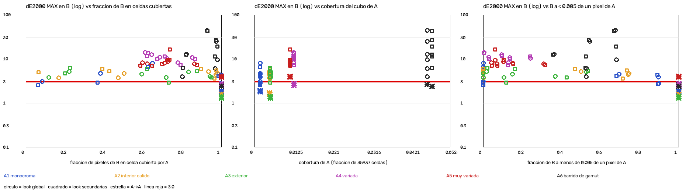

# MEDICIÓN T5 — el grado extraído de un plano, aplicado a otro

**Medidor de T5, 16-09-2026.** No he escrito ni una línea de `core/`, no he tocado nada
fuera de `tests/fuera_de_plano/` y de este archivo, y no he arreglado nada.

---

## Veredicto

**No sirve fuera de su plano con el criterio del proyecto: con la cobertura de un plano
normal (0.41% del cubo), el ΔE2000 máximo en el otro plano pasa de 3.0 en 12 de 12 casos
(de 3.59 a 5.92), también cuando el otro plano es otra toma con la misma paleta. Y no hay
cobertura que lo arregle dentro de lo que he medido (hasta el 4.8%).** Lo que sí aguanta
es la media (de 0.34 a 1.69) y, con escenas casi idénticas, el p95 (de 0.91 a 1.29). El
único alivio aparece al quitar los brillos por encima del blanco, y sólo con una carta de
barrido de gamut (4.7% de cobertura): ahí baja de 3.0 en 6 de 12 pares.

La culpa **no es sobre todo de las celdas inventadas**. El peor píxel cae en una celda
**con datos** en 46 de 72 pares (55 de 72 si se quitan los brillos por encima del blanco).
La causa es mixta: por píxel, las celdas inventadas fallan más; pero los errores más
gordos salen de celdas que tienen datos. Detalle en §6.

---

## 1 · Contra qué código se ha medido

Todo contra la copia congelada `.snapshots/v0.3.0`, con ese directorio como `cwd`. El
comando de **todas** las cifras de este documento es éste, lanzado desde la raíz del repo:

```bash
cd .snapshots/v0.3.0 && PYTHONDONTWRITEBYTECODE=1 ../../.venv/bin/python -m pytest \
  ../../tests/fuera_de_plano -s -p no:cacheprovider --import-mode=importlib --noconftest -rxXs
```

Tarda 3 min 19 s. La salida entera de la última ejecución (16-09-2026, de 11:51:56 a 11:55:15 CEST) está en
`tests/fuera_de_plano/salida_t5.txt`, los datos por punto en `resultados_t5.csv` y la
gráfica en `curva_t5.png`. Para sacar una sección basta con añadir al final del comando
`| grep "<etiqueta>"`; cada tabla de abajo dice qué etiqueta es la suya.

La comprobación (`grep "T5 guardia"`), al principio de la ejecución y sin cambios en la
última:

```
[T5 guardia] core.__file__=/Users/mariobote/Documents/Varios/CLAUDE CODE/sidebflms-color/.snapshots/v0.3.0/core/__init__.py
[T5 guardia] core.reverse.__file__=/Users/mariobote/Documents/Varios/CLAUDE CODE/sidebflms-color/.snapshots/v0.3.0/core/reverse/__init__.py
[T5 guardia] t5_material.__file__=/Users/mariobote/Documents/Varios/CLAUDE CODE/sidebflms-color/tests/fuera_de_plano/t5_material.py
```

`find .snapshots -newermt "2026-09-16 11:17:00"` después de la última ejecución: vacío.
No he escrito nada dentro de la copia.

### Por qué hacen falta tres opciones más que en el encargo, y cuidado: esto es una trampa de verdad

El comando del encargo tal cual (`../../.venv/bin/python -m pytest <test> -s`) **mide el
repo vivo, no la copia**. Lo he comprobado; la guardia del test lo caza y lo salta:

```
SKIPPED [1] ../../tests/fuera_de_plano/test_t5_fuera_de_plano.py:261: T5 mide v0.3.0 y `core` ha resuelto a /Users/mariobote/Documents/Varios/CLAUDE CODE/sidebflms-color/core/__init__.py. ...
```

El motivo: en su modo por defecto (`prepend`), pytest mete en `sys.path[0]` la carpeta
padre del primer directorio sin `__init__.py`, y como `tests/` y `tests/fuera_de_plano/`
son paquetes, esa carpeta es la **raíz del repo vivo**. Además `tests/conftest.py` del vivo
se carga antes e importa `core` desde ahí. Es exactamente el resultado fantasma del día 3.

- `--import-mode=importlib`: pytest no toca `sys.path`; `import core` resuelve contra el `cwd`.
- `--noconftest`: no se carga `tests/conftest.py` del vivo (importa `core` y `tests.media`).
- `PYTHONDONTWRITEBYTECODE=1`: que importar `core` no deje `.pyc` en `.snapshots/`.
- Mi test mete **su propia carpeta** en `sys.path` e importa `t5_material` como módulo
  suelto: con `importlib`, el paquete `tests` del `cwd` es el de la copia y no tiene mi carpeta.
- Si alguien lo lanza de otra forma, `core` no resuelve a la copia y los tests **se saltan**
  diciendo por qué (se puede forzar con `T5_PERMITIR_REPO_VIVO=1`, pero entonces las
  cifras no son éstas).

---

## 2 · El montaje

Todo sale de `tests/fuera_de_plano/t5_material.py`, que **no importa `core`**. No usa
`tests/media/generate.py`, `tests/conftest.py`, `tests/test_entregables.py` ni
`tests/medicion/`.

**Escenas.** 640×360, en luz lineal con primarios Rec.709, llevadas al espacio de trabajo
(DWG / DaVinci Intermediate) con `colour-science`. Un fondo en degradado, N objetos
(elipses y rectángulos) con un color de paleta y ~2 pasos de modelado de luz dentro, brillos
especulares y grano. La paleta decide el centro y la anchura del abanico de tono, la
saturación, la exposición y cuántos objetos hay.

| Escena A | Tono | Saturación | Objetos | Cobertura del cubo (global / secundarias) |
|---|---|---|---|---|
| A1 monocroma | 12° | 0.10–0.30 | 4 | 0.1530% / 0.1586% |
| **A2 interior cálido** — el «plano normal» | 50° | 0.10–0.55 | 7 | **0.4063% / 0.4118%** |
| A3 exterior | 150° | 0.10–0.65 | 10 | 0.4285% / 0.4174% |
| A4 variada | 280° | 0.05–0.80 | 16 | 1.0546% / 1.0630% |
| A5 muy variada | 360° | 0.02–0.92 | 28 | 0.9600% / 0.9628% |
| A6 barrido de gamut | 360°, fondo que barre tono × saturación × 6 pasos | 0–0.92 | 6 | 4.6554% / 4.7834% |

A6 no es un plano normal: es una carta pensada para empujar la cobertura muy por encima
del ~1% que da una escena rica. La cobertura es `coverage.coverage_fraction()` del
resultado (celdas con ≥ 4 muestras) (`grep "T5 ref"`, campo `cob_A`).

**Escenas B.** Para cada A, seis: B0 misma paleta y otra toma (otra semilla y otra
composición), y B1–B5 con la paleta girada de tono (8°, 25°, 80°, 170°, 180°) y con cambios
de exposición y saturación. **Los nombres de B no son el nivel**: el nivel lo da el número.

**La disparidad es un número.** `solape_hist` = intersección de los histogramas 3D de A y
de B en el cubo de 33³ (celda más cercana, espacio de trabajo **en bruto**, sin ningún
grado): `Σ min(pA, pB)`. 1 = mismas celdas en la misma proporción; 0 = ninguna en común.
Los niveles son tramos que fijé antes de mirar el ΔE agrupado por nivel:

| Nivel | Tramo de `solape_hist` |
|---|---|
| N1 casi idénticas | ≥ 0.55 |
| N2 parecidas | 0.30 – 0.55 |
| N3 distintas | 0.10 – 0.30 |
| N4 muy distintas | < 0.10 |

**Grado conocido** = CDL y después LUT 33³, en ese orden (el contrato).
CDL: slope (1.04, 1.00, 0.955), offset (0.006, 0, −0.006), power (0.98, 1.00, 1.02), sat 1.08.
Dos looks: **global** (curva en S con pivote 0.38, sombras a verde azulado, altas luces a
cálido, compresión de la croma alta: todo depende de luma y croma) y **secundarias** (lo
mismo más verdes hacia amarillo −25% sat, azules hacia cian, naranjas +12% sat, suave y
ponderado por croma). Lo aplico con **mi** CDL y **mi** trilineal, no con `CDL.apply` ni
`LUT3D.apply`.

Que el grado es plausible (`grep "T5 material"`):

| Look | `qc_lut` | No monótonas | Escalones de banding | Distancia máx. a la identidad | Mi aplicación vs. la del repo |
|---|---|---|---|---|---|
| global | limpio | 0 | 0 | 0.1875 | 5.1e-08 |
| secundarias | limpio | 0 | 0 | 0.3297 | 4.5e-08 |

Fuerza del grado, ΔE2000 medio entre A y A': de 5.61 a 12.50 según escena y look
(`grep "T5 ref"`, campo `fuerza_grado_medio`).

**Extracción**: `core.reverse.invertir_grado(A, A')`, sólo la API pública.
**Predicción**: `lut.apply(cdl.apply(B))`. **Comparación**: con B' = mi grado conocido sobre B.

**Métrica**: ΔE2000 de `colour-science`. Camino: `oetf_inverse_DaVinciIntermediate` →
`RGB_to_XYZ("DaVinci Wide Gamut", illuminant=None)` → `XYZ_to_Lab(D65)` →
`delta_E_CIE2000`. Nada de `core.color`. Sobre **todos** los píxeles de B. Como
comprobación cruzada, mi máximo A→A coincide con el `de_max_cubierto` que dice el propio
repo en las 12 referencias, a 6 cifras (`grep "T5 ref"`, `cub_max` frente a
`repo_de_max_cubierto`).

**«sdr»** = la misma cifra quitando los píxeles cuyo B' tiene L\* > 100 (brillos por encima
del blanco difuso, donde el ΔE2000 no es una medida perceptual válida). Son del 0% al
36.4% de los píxeles en los pares de A1–A5 (lo alto, en las B con más exposición) y del
0.9% al 43.9% en los de A6 (`frac_px_hdr` en `grep "T5 AB"` y `grep "T5 ref"`).

---

## 3 · Referencia A→A (extraer de A, comprobar sobre A)

`grep "T5 ref"`. En A→A todos los píxeles caen en celda cubierta (`frac_px_cub = 1`), así
que «todo» y «zona cubierta» coinciden.

| Escena A | Look | Medio | p95 | **Máx.** |
|---|---|---|---|---|
| A1 | global / secundarias | 0.2975 / 0.2766 | 0.7265 / 0.6759 | 1.8904 / 1.7947 |
| **A2** | global / secundarias | **0.1875 / 0.1402** | **0.4729 / 0.3455** | **1.6949 / 1.5687** |
| A3 | global / secundarias | 0.1016 / 0.1219 | 0.2699 / 0.3129 | 1.2905 / 1.4015 |
| A4 | global / secundarias | 0.1635 / 0.1612 | 0.4144 / 0.4034 | 2.4694 / 2.7455 |
| **A5** | global / secundarias | 0.1486 / 0.1541 | 0.4332 / 0.4504 | **4.0009 / 3.8541** ← no cumple el T1 |
| A6 | global / secundarias | 0.0303 / 0.0653 | 0.0841 / 0.1685 | 2.6542 / 2.3734 |

A2→A2 da 1.69 / 1.57, del orden del 1.7409 publicado para el T1: mi montaje reproduce el
caso fácil.

---

## 4 · A→B por nivel de disparidad, con A→A al lado

`grep "T5 nivel"`. 72 pares = 2 looks × 6 escenas A × 6 escenas B.

| Nivel | Pares | `solape_hist` | ΔE medio (mediana · peor) | p95 (mediana · peor) | **Máx. (mediana · mejor · peor)** | Pares con máx. < 3 | Máx. sdr (mediana · peor) | Pares con máx. sdr < 3 |
|---|---|---|---|---|---|---|---|---|
| N1 casi idénticas | 14 | 0.566–0.704 | 0.352 · 0.629 | 1.148 · 1.680 | **5.063 · 2.677 · 44.384** | **2 de 14** | 4.093 · 6.112 | 5 de 14 |
| N2 parecidas | 12 | 0.301–0.529 | 0.409 · 1.257 | 1.323 · 6.358 | **5.160 · 3.826 · 12.658** | **0 de 12** | 4.066 · 6.297 | 3 de 12 |
| N3 distintas | 32 | 0.109–0.285 | 1.111 · 2.960 | 3.102 · 6.167 | **7.858 · 2.873 · 16.458** | **2 de 32** | 7.858 · 16.458 | 2 de 32 |
| N4 muy distintas | 14 | 0.008–0.099 | 1.382 · 2.593 | 2.542 · 4.189 | **4.850 · 2.533 · 10.718** | **1 de 14** | 4.850 · 10.718 | 1 de 14 |
| *A→A (referencia)* | *12* | *1* | *0.030–0.298* | *0.084–0.727* | *1.290–4.001* | *10 de 12* | *1.290–4.001* | *10 de 12* |

**5 de 72** pares A→B bajan de 3.0 de máximo (11 de 72 sin píxeles de L\* > 100). Los cinco:
A1 monocroma (B0 global 2.7891, B0 secundarias 2.6771, B4 secundarias 2.5329, B5
secundarias 2.8748) y A3 exterior (B2 secundarias 2.8734).

Nota honesta: el máximo **no** empeora de forma limpia de N1 a N4 (N4 tiene una mediana
menor que N3). La media sí empeora: 0.35 → 0.41 → 1.11 → 1.38.

### El caso de uso: A2, el plano normal

`grep "T5 AB" | grep "A2 interior"`.

| B | Nivel (`solape_hist`) | B en celda cubierta | Look | Medio | p95 | **Máx.** | Píxeles > 3 |
|---|---|---|---|---|---|---|---|
| B0 misma paleta, otra toma | N1 (0.7040) | 98.0% / 97.5% | global / sec. | 0.4013 / 0.3671 | 1.2072 / 1.2866 | **4.6466 / 5.4789** | 0.76% / 1.23% |
| B1 | N1 (0.6024) | 97.2% / 96.5% | global / sec. | 0.3857 / 0.3378 | 1.0307 / 0.9116 | **4.4425 / 3.5931** | 0.24% / 0.40% |
| B2 | N3 (0.1805) | 93.6% / 89.7% | global / sec. | 0.6881 / 0.4755 | 1.9458 / 1.5572 | **5.1275 / 5.9213** | 0.62% / 0.59% |
| B3 | N4 (0.0980) | 50.4% / 42.7% | global / sec. | 0.8038 / 0.9199 | 1.5982 / 2.6614 | **4.6784 / 5.2552** | 0.05% / 3.87% |
| B4 | N4 (0.0134) | 16.8% / 6.5% | global / sec. | 1.3676 / 1.0042 | 2.0989 / 2.0823 | **3.7498 / 4.9963** | 0.02% / 1.47% |
| B5 | N4 (0.0082) | 47.2% / 39.2% | global / sec. | 1.6074 / 1.6852 | 2.8102 / 4.0102 | **3.7446 / 5.9154** | 3.62% / 14.15% |
| *A2→A2* | *1* | *100%* | *global / sec.* | *0.1875 / 0.1402* | *0.4729 / 0.3455* | *1.6949 / 1.5687* | *0 / 0* |

Sin los píxeles de L\* > 100 no cambia ninguno salvo B3 global (4.4999).

---

## 5 · La curva frente a la cobertura, y la cifra de corte



`curva_t5.png`: ΔE máximo en B (escala logarítmica) frente a (1) la fracción de píxeles de
B en celda cubierta por A, (2) la cobertura del cubo de A y (3) la fracción de B a menos de
0.005 de un píxel de A. Línea roja = 3.0. Estrellas = A→A.

Resumen por escena A (mínimo y máximo sobre sus 6 filas `grep "T5 AB"`):

| A | Look | Cobertura | Máx. A→A | **Máx. en B** | Máx. sdr en B | p95 en B | Medio en B | Pares con máx. < 3 (todo / sdr) |
|---|---|---|---|---|---|---|---|---|
| A1 | global | 0.153% | 1.89 | 2.79–8.02 | 2.79–8.02 | 1.15–6.17 | 0.41–2.96 | 1 / 1 de 6 |
| A1 | sec. | 0.159% | 1.79 | 2.53–6.44 | 2.53–6.44 | 1.25–4.94 | 0.42–2.33 | 3 / 3 de 6 |
| **A2** | global | **0.406%** | 1.69 | **3.74–5.13** | 3.74–5.13 | 1.03–2.81 | 0.39–1.61 | **0 / 0 de 6** |
| **A2** | sec. | **0.412%** | 1.57 | **3.59–5.92** | 3.59–5.92 | 0.91–4.01 | 0.34–1.69 | **0 / 0 de 6** |
| A3 | global | 0.429% | 1.29 | 3.76–5.15 | 3.76–5.15 | 0.86–2.55 | 0.26–1.40 | 0 / 0 de 6 |
| A3 | sec. | 0.417% | 1.40 | 2.87–6.28 | 2.87–6.28 | 0.95–4.27 | 0.33–2.59 | 1 / 1 de 6 |
| A4 | global | 1.055% | 2.47 | 8.10–13.97 | 8.10–13.97 | 2.18–4.71 | 0.89–2.01 | 0 / 0 de 6 |
| A4 | sec. | 1.063% | 2.75 | 7.26–13.84 | 7.26–13.84 | 2.06–4.33 | 0.83–1.97 | 0 / 0 de 6 |
| A5 | global | 0.960% | 4.00 | 7.67–9.27 | 7.67–9.27 | 2.58–4.17 | 0.94–1.55 | 0 / 0 de 6 |
| A5 | sec. | 0.963% | 3.85 | 7.03–16.46 | 7.03–16.46 | 2.68–3.81 | 0.91–1.57 | 0 / 0 de 6 |
| A6 | global | 4.655% | 2.65 | 3.93–44.38 | 0.37–3.93 | 0.14–6.36 | 0.05–1.01 | 0 / 5 de 6 |
| A6 | sec. | 4.783% | 2.37 | 6.30–42.45 | 0.51–6.30 | 0.26–5.02 | 0.10–0.85 | 0 / 1 de 6 |

### Cifra de corte

`grep "T5 corte ambos"`. «Corte» = el menor valor a partir del cual **todos** los puntos
bajan de 3.0; `nan` = no existe.

| Variable | Máx. < 3 | Máx. sdr < 3 | **p95 < 3** |
|---|---|---|---|
| Fracción de B en celda cubierta por A | **no hay corte**: falla un par con el 99.947% de B cubierto | no hay corte (ídem) | **≥ 0.8767** (el peor que falla: 0.8643) |
| Cobertura del cubo de A | **no hay corte**: falla con 4.78% | no hay corte | no hay corte |
| `solape_hist` | no hay corte: falla con 0.7040 | no hay corte | ≥ 0.4045 (el peor que falla: 0.3006) |
| Fracción de celdas de B que también ocupa A | no hay corte: falla con 0.9157 | no hay corte | ≥ 0.7923 |
| Fracción de B a < 0.005 de un píxel de A | 0.8988 — **no vale**: es un único punto, y el siguiente (0.8980) falla con 3.85 | ídem | ≥ 0.3681 |

**Respuesta directa: con el máximo como criterio no hay cifra de corte, ni de cobertura ni
de fracción de B cubierta, en el rango medido (del 0.15% al 4.8% de cobertura, del 6.3% al
99.95% de B en celda cubierta).** Sólo aparece corte si el criterio pasa a ser el p95: el
p95 en B baja de 3.0 en los 72 pares siempre que al menos el **87.7%** de los píxeles de B
caiga en celda cubierta por A.

### ¿Qué explica mejor el error?

`grep "T5 spearman"`. Correlación de rangos de Spearman sobre los 72 pares; negativo =
más de esa variable, menos error.

| | Fracción de B cubierta | ídem, 8 nodos | Cobertura de A | `solape_hist` | Celdas de B en A | B a < 0.0025 | B a < 0.005 | B a < 0.01 |
|---|---|---|---|---|---|---|---|---|
| **Máx.** | +0.091 | +0.361 | **+0.780** | +0.090 | +0.087 | +0.040 | +0.021 | −0.001 |
| Máx. sdr | −0.218 | −0.133 | +0.314 | −0.285 | −0.289 | −0.231 | −0.288 | −0.339 |
| p95 | −0.541 | −0.490 | −0.024 | −0.553 | −0.578 | −0.594 | **−0.615** | −0.598 |
| Medio | −0.650 | **−0.733** | −0.178 | −0.718 | −0.706 | −0.700 | −0.721 | −0.726 |

- Para la **media y el p95**, tu intuición se cumple: manda **dónde vive B respecto a A**
  (fracción de B cubierta, a poca distancia de A, o compartiendo celdas), no la cobertura
  de A por sí sola (−0.18 / −0.02).
- Para el **máximo**, ninguna de las dos lo explica. La única correlación fuerte es con la
  cobertura de A, **y va al revés**: +0.78, o sea que escenas A más ricas dan máximos
  **peores** en B. A4 y A5 (~1%) son las peores de todas (7–16).

---

## 6 · Desglose: celdas cubiertas frente a inventadas

`grep "T5 zona"` y `grep "T5 peor pixel"`. Todas las máscaras se calculan sobre
`cdl_extraído(B)`, que es el dominio del LUT, contra el `CoverageMap` de A:
**cub** = la celda más cercana tiene ≥ 4 muestras (la definición de «zona cubierta» del
repo); **inv** = la celda más cercana tiene `counts == 0`; **medio** = de 1 a 3 muestras;
**cub8** / **inv8** = los **ocho** nodos de la interpolación cubiertos / inventados.

| Zona (72 pares A→B) | Píxeles | Media ponderada | Tasa de píxeles > 3 | Peor máx. | Mediana del máx. | Pares con máx. < 3 |
|---|---|---|---|---|---|---|
| cub | 1.17425e7 | 0.777 | 4.03% | 18.215 | 5.538 | 11 de 72 |
| medio | 150 710 | 1.606 | 11.15% | 12.448 | 3.178 | 27 de 58 |
| inv | 4.69561e6 | 1.557 | 9.67% | 44.384 | 4.661 | 18 de 72 |
| cub8 | 4.73974e6 | 0.325 | 0.45% | 11.529 | 3.092 | 32 de 66 |
| inv8 | 1.51977e6 | 2.096 | 20.55% | 44.384 | 3.557 | 24 de 62 |
| cub, sin L\*>100 | 1.10816e7 | 0.799 | 4.21% | 16.458 | 4.329 | 18 de 72 |
| inv, sin L\*>100 | 4.38773e6 | 1.494 | 8.36% | 10.562 | 4.452 | 22 de 70 |
| inv8, sin L\*>100 | 1.37496e6 | 1.959 | 18.07% | 6.281 | 3.004 | 29 de 59 |

**Zona del peor píxel de cada par:** cub **46**, medio 7, inv 19 (sin L\* > 100: cub **55**,
inv 17).

Cómo lo leo:

1. **Las inventadas se equivocan como cabía esperar**: a igualdad de píxeles fallan más
   (tasa > 3 del 9.7% frente al 4.0%; con los ocho nodos inventados, 20.6%), pero en SDR
   su peor máximo es 6.28 con los 8 nodos inventados. Es el error «esperable».
2. **Las cubiertas son las que rompen el máximo**, y eso es lo malo: en 46 de 72 pares el
   peor píxel está en una celda con datos, y ahí aparecen 11.5 incluso con los **ocho**
   nodos cubiertos (secundarias, A4, B0). Ese píxel (`grep "T5 anatomia"`) es un gris
   claro de B, entrada (0.4201, 0.4304, 0.3907) y L\* 79.97, cuyos 8 nodos tienen 4177,
   2367, 3181, 4068, **7**, 135, **14** y 2605 muestras. Los ocho «cubiertos», pero el píxel
   de A más cercano está a 0.0203 (2/3 de celda), y el LUT predice (0.4491, 0.4499,
   0.3592) donde debía dar (0.4649, 0.4384, 0.3482): ΔE 11.5292. Lo que lo generaliza:
3. **La variable que ordena el error es la distancia al píxel real de A más cercano**, no
   la cobertura de la celda (`grep "T5 dist A->B"`, 72 pares, dominio del LUT, una celda
   mide 0.03125):

   | Distancia al píxel de A más cercano | Fracción de B | ΔE medio | Peor máx. |
   |---|---|---|---|
   | < 0.0025 | 18.6% | 0.261 | 4.006 |
   | 0.0025 – 0.005 | 10.2% | 0.348 | 4.500 |
   | 0.005 – 0.01 | 13.9% | 0.534 | 8.049 |
   | 0.01 – 0.02 | 18.3% | 1.095 | 13.284 |
   | 0.02 – 0.04 | 26.8% | 1.526 | 27.557 |
   | ≥ 0.04 | 12.2% | 1.949 | 44.384 |

   Mi lectura, **como hipótesis y no como medida**: «≥ 4 muestras» dice que hay datos,
   pero no que los ocho valores del nodo estén determinados. Con muestras amontonadas en
   una esquina de la celda, el ajuste por mínimos cuadrados clava A y deja libre el resto
   de la celda. Eso encaja con que las escenas A ricas (muchas celdas con pocas muestras)
   den los peores máximos en B. Comprobarlo exigiría mirar dentro del ajuste, y eso ya no
   es medir desde fuera.

---

## 7 · Lo que me ha llamado la atención sin que me lo preguntaran

1. **El comando del encargo mide el repo vivo** (§1). No lo digo por decir: lo ejecuté y
   `core` resolvía a `sidebflms-color/core/__init__.py`. Cualquier medición «contra la
   copia» hecha hoy con `python -m pytest ../../tests/...` sin `--import-mode=importlib`
   está hecha contra el código que otros están editando.
2. **El T1 no aguanta una escena A más rica ni en el caso fácil.** A5 (28 objetos, tono
   360°): ΔE máximo A→A de **4.0009** (global) y **3.8541** (secundarias). El propio repo
   dice lo mismo (`de_max_cubierto` 4.00095 y 3.85405). El 1.7409 publicado depende de la escena.
3. **El aviso de cobertura baja avisa al revés de lo que he medido.** `invertir_grado` añade
   «Vale para este plano; para otro con colores distintos, no» cuando la cobertura es menor
   que `UMBRAL_COBERTURA_BAJA` = 0.5%. Avisa en A1–A3 y **calla en A4 y A5 (~1%), que son
   las que peor se llevan a otro plano** (máximos de 7 a 16). Y a la vez es falso que valga
   para otro plano con colores iguales: A2 → B0 misma paleta da 4.65 / 5.48
   (`grep "T5 ref"`, campo `aviso_cobertura`).
4. **Los «diez números legibles» no son el CDL del colorista.** Con el CDL conocido
   (1.04, 1.00, 0.955 / 0.006, 0, −0.006 / 0.98, 1.00, 1.02 / 1.08), el extraído sale, en
   las 12 extracciones, con slope de 1.1752 a 1.1911 en rojo, offset azul de 0.0202 a
   0.0964 y **power azul de 1.1930 a 1.4663** (`grep "T5 cdl"`). El CDL se queda con parte del
   contraste del LUT. Sobre A el conjunto CDL+LUT cuadra, pero quien lea el nodo 2
   leerá números que el colorista no puso.
5. **En A6 el máximo lo deciden los brillos.** El 44.3838 es un píxel con L\* 173.48,
   muy por encima del blanco difuso, con los 8 nodos inventados y a 0.1142 del píxel de A
   más cercano (`grep "T5 anatomia"`); ahí el ΔE2000 no es perceptual. Sin esos píxeles,
   A6 global baja de 3.0 en 5 de 6 B (A6 secundarias, en 1 de 6). Por eso cada cifra va
   también «sdr». En A2 la distinción no cambia nada.
6. **El máximo es poco robusto como único criterio.** En A2 → B1 el máximo es 4.44 con el
   0.24% de píxeles por encima de 3. Lo digo como dato, **no** para rebajar el criterio: el
   día 3 se decidió que manda el máximo, y con el máximo el veredicto es el de arriba.

---

## 8 · Tests (`tests/fuera_de_plano/`)

`ruff check tests/fuera_de_plano`: `All checks passed!`. Resultado de la última ejecución:
**14 passed, 4 xfailed**.

| Test | Qué afirma | Estado |
|---|---|---|
| `test_t5_guardia_core_resuelve_a_la_copia_congelada` | `core` y `core.reverse` resuelven a `.snapshots/v0.3.0` | pasa |
| `test_t5_el_grado_conocido_es_plausible` | `qc_lut` limpio, lejos de la identidad, mi aplicación = la del repo (< 1e-5) | pasa |
| `test_t5_tabla_curva_y_corte` | nada: imprime la medida, escribe CSV y PNG | pasa |
| `test_t5_anatomia_de_los_peores_pixeles` | nada: imprime dos píxeles concretos | pasa |
| `test_t5_referencia_A_a_A_max_bajo_3_en_zona_cubierta[...]` × 12 | T1 en mi montaje | 10 pasan; **A5 × 2: `xfail(strict=True)`** con 4.0009 / 3.8541 |
| `test_t5_A_a_B_max_bajo_3_con_la_cobertura_de_un_plano_normal` | A2 → 6 B × 2 looks, máx. < 3 | **`xfail(strict=True)`**: 12 de 12 fallan |
| `test_t5_A_a_B_max_bajo_3_en_toda_escena_casi_identica` | nivel N1, máx. < 3 | **`xfail(strict=True)`**: 12 de 14 fallan |

Los `reason` llevan las cifras, el umbral, el comando y qué haría falta para cerrarlos.

---

## 9 · Límites de esta medida

- **Material sintético.** Escenas con bordes duros y paletas controladas; no son planos
  reales. La conclusión del máximo es robusta dentro del montaje (72 pares, 2 looks), pero
  el número exacto en material real puede ser otro. Cifra en material real: **no medido**.
- **Una semilla por escena.** No hay barrido de semillas: la dispersión entre tomas de la
  misma paleta sólo se ve en B0.
- **Los tramos de nivel y los radios de distancia son míos.** Los tramos de `solape_hist`
  los fijé antes de agrupar por nivel. El radio 0.005 lo elegí **después** de un diagnóstico
  a mano sobre el par A4/B0 secundarias; por eso doy también 0.0025 y 0.01.
- **Un solo grado conocido de CDL** y dos looks. Un look más agresivo por tono, o uno sin
  componente de contraste, podría dar otra partición CDL/LUT.

---

## 10 · Filas para `CIFRAS.md`

No es mi archivo; van aquí, en su formato, para quien lo lleve. Montaje de todas:
**independiente T5, `tests/fuera_de_plano/`, contra `.snapshots/v0.3.0`, 640×360, ΔE de
`colour`**. Comando de todas: el de §1, con el `grep` indicado. Fecha de todas: **16-09**.

| Cifra | Valor | Montaje | Comando | Fecha |
|---|---|---|---|---|
| **T5 máx. en B, plano normal (A2, 0.41%), 12 pares** | **3.5931 – 5.9213; 0 de 12 < 3.0** | T5 | §1 `\| grep "T5 AB" \| grep "A2 interior"` | 16-09 |
| T5 medio en B, plano normal | 0.3378 – 1.6852 | ídem | ídem | 16-09 |
| T5 p95 en B, plano normal | 0.9116 – 4.0102 | ídem | ídem | 16-09 |
| T5 A2→A2 máx. (referencia) | 1.6949 / 1.5687 | ídem | §1 `\| grep "T5 ref"` | 16-09 |
| T5 pares A→B con máx. < 3.0 | **5 de 72** (11 de 72 sin L\*>100) | 6 escenas A × 6 B × 2 looks | §1 `\| grep "T5 nivel"` | 16-09 |
| T5 nivel N1 (solape ≥ 0.55), máx. < 3.0 | 2 de 14 | ídem | ídem | 16-09 |
| T5 corte de cobertura para máx. < 3.0 | **no existe** en 0.15%–4.8% | ídem | §1 `\| grep "T5 corte ambos"` | 16-09 |
| T5 corte de fracción de B cubierta para p95 < 3.0 | ≥ 0.8767 | ídem | ídem | 16-09 |
| T5 Spearman máx. frente a cobertura de A | +0.780 | ídem | §1 `\| grep "T5 spearman"` | 16-09 |
| T5 peor píxel en celda cubierta / media / inventada | 46 / 7 / 19 de 72 | ídem | §1 `\| grep "T5 peor pixel"` | 16-09 |
| T1 A→A máx. en escena rica (A5) | **4.0009 / 3.8541** — no cumple < 3.0 | T5, escena A5 | §1 `\| grep "T5 ref"` | 16-09 |
| Cobertura A que no dispara el aviso y peor se lleva a otro plano | A4 1.0546% · A5 0.9600%, máx. en B 7.03–16.46 | T5 | §1 `\| grep "T5 ref"` y `"T5 AB"` | 16-09 |
| Power azul del CDL extraído frente al conocido (1.02) | 1.1930 – 1.4663 | T5, 12 extracciones | §1 `\| grep "T5 cdl"` | 16-09 |
